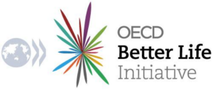
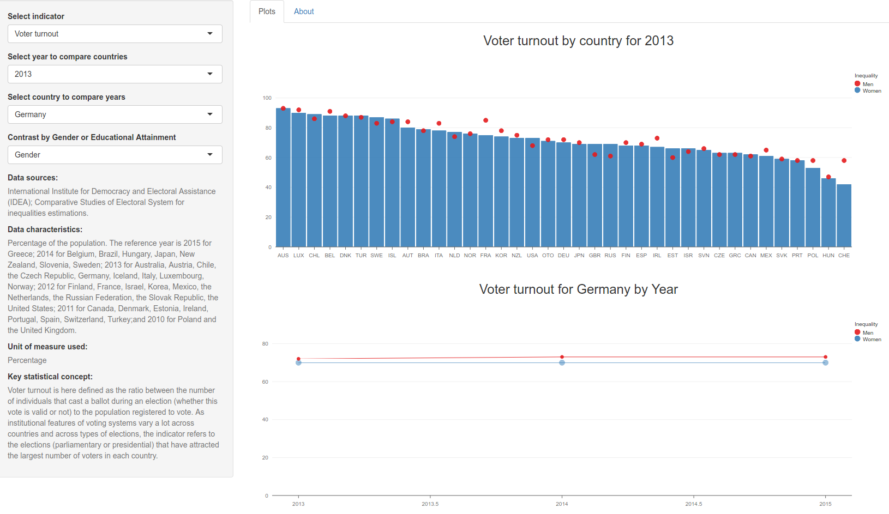

Exploring the Better Life Index
========================================================
author: Radu Grosu
date: 20 september 2015


Introduction
========================================================
This presentation was created as part of the course project for the **Developing Data Products** class within the **Coursera** *Data Science specialization track*.

It is supposed to showcase the possibilities offered by RStudio's **Shiny** web-app building platform and the extra interactivity offered by the **rCharts** package.


Is Life Really Getting Better?
========================================================



The **Organisation for Economic Co-Operation and Development** (OECD) has been gathering data for more than a decade in an effort to measure the progress of societies.

The **OECD** *Better Life Initiative* moves beyond GDP and focuses on developing statistics to capture aspects of life that matter to people and that shape the quality of their lives.

The app is available here:  https://radu.shinyapps.io/BetterLifeIndex

The Data
========================================================
The datasets used for this visualisation is provided by the **OECD** as a part of its *Better Life Initiative*, an effort which allows the **OECD** to better advise policy makers on the priorities they should concentrate on to deliver better lives for their citizens.

The data mostly come from official sources such as the *OECD* or National Accounts, *United Nations Statistics*, *National Statistics Offices*. A couple of indicators are based on data from the *Gallup World Poll* a division of the **Gallup Organization** that regularly conducts public opinion polls in more than 140 countries around the world.


Data Snippet
========================================================


Indicators available for socio-economic inequality:

```r
sort(unique(filter(ble, Inequality=="High")$Indicator))
```

```
 [1] "Employment rate"                         
 [2] "Household net adjusted disposable income"
 [3] "Life satisfaction"                       
 [4] "Long-term unemployment rate"             
 [5] "Personal earnings"                       
 [6] "Quality of support network"              
 [7] "Self-reported health"                    
 [8] "Student skills"                          
 [9] "Voter turnout"                           
[10] "Water quality"                           
```


The App
========================================================
For any chosen indicator the first plot displays its measure across countries for the chosen year; the second plot diplays its measure for the selected country across the available years.<br>
One of two contrasts can be chosen: differences due to *Gender*, and differences due to
*Socio-economic status*.

